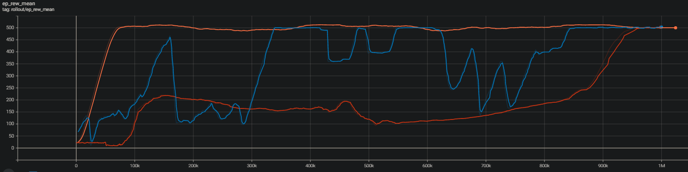
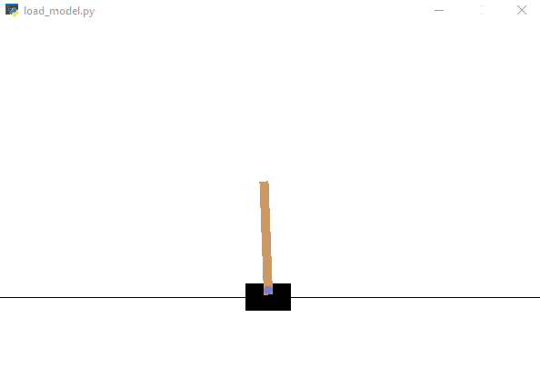
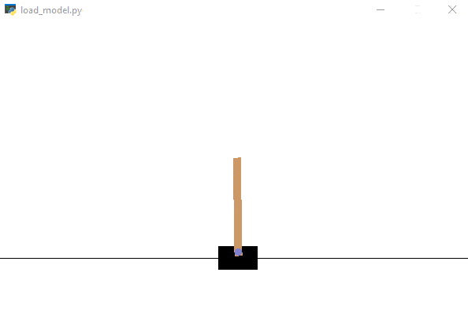

# Reinforment Learning with Stable Baselines 3
## Abstract
Stable Baselines is an open-source Python library that contains a set of implementations for reinforment learning which can be run in the gyms offered by OpenAI. This code is an experiment to see how the PPO (Proximal Policy Optimization), A2C (Advantage Actor Critic) and DQN (Deep Q Learning) algorithms perform against each other within the [CartPole](https://gym.openai.com/envs/CartPole-v1/) gym. The goal of this gym is to balance the pole ontop of the cart for as long as possible.

## Prerequisites
- Python 3.8.0

## Dependencies
Run the following command to install the dependencies required for the code;
- `pip install pipenv`
- `pipenv install`

## Training the Models
Run the following command in order to train the PPO, A2C, and DQN models;
- `pipenv run train <opt:epochs>`
where epochs >= 1, epochs <= 100 (optional argument, default: 25). Note: epochs is value specified * 10,000.

## Viewing the Models Performance
Run the following command to initialize TensorBoard, which will allow you to compare and contrast the models. You can do this by viewing the 'ep_rew_mean' graph which shows the average episode reward mean value, which indicates how well the model is performing in the gym.
- `pipenv run metrics`

Then visit: `http://localhost:6006/` to view the data.

## Loading Simulations of the Models
Run the following command in order to train the PPO, A2C or DQN models;
- `pipenv run load <algorithm> <modelFileName>.zip`
where algorithm is PPO, A2C, or DQN and modelFileName must exist relative to 'models/algorithm/' directory.

## Results
The graph below shows the average reward value per episode for each of the models over 1,000,000 epochs.
- PPO (orange)
- A2C (blue)
- DQN (red)

### PPO - 10,000 epochs into training

### PPO - 100,000 epochs into training

## Resources
1. [Stable Baselines Documentation](https://stable-baselines.readthedocs.io/en/master/)
2. [OpenAI Gyms](https://gym.openai.com/envs/#classic_control)
3. [Reinforment Learning in Python with Stable Baselines 3](https://pythonprogramming.net/introduction-reinforcement-learning-stable-baselines-3-tutorial/ )
